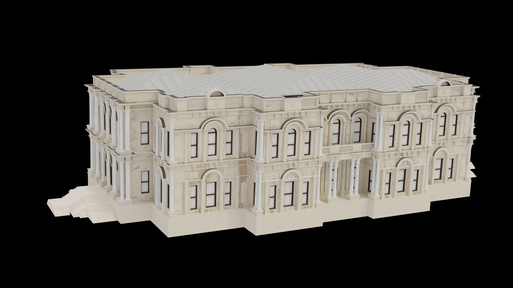

#  BeylerbeyiPalace3D
### Project for Computer Graphics course, Faculty of Electrical Engineering 2020/21

3D model of Beylerbeyi Palace (Istanbul) was created in **Blender**. The AR app was created in **Unity3D** using **Vuforia** AR camera for image recognition.

# [Source code](https://drive.google.com/file/d/1GBrR0j9768yOeXd3oTHtP2NP10QY3c1w/view?usp=sharing)  

# [Video](https://drive.google.com/file/d/110Mu_G91JpTdL50bgwL-e3lHnkOWAC47/view?usp=sharing)  

